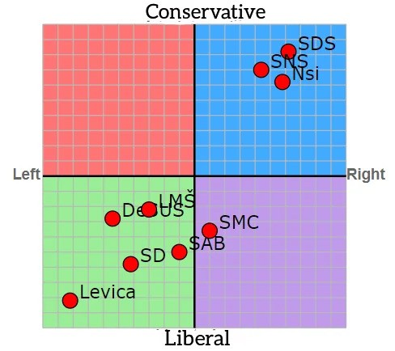
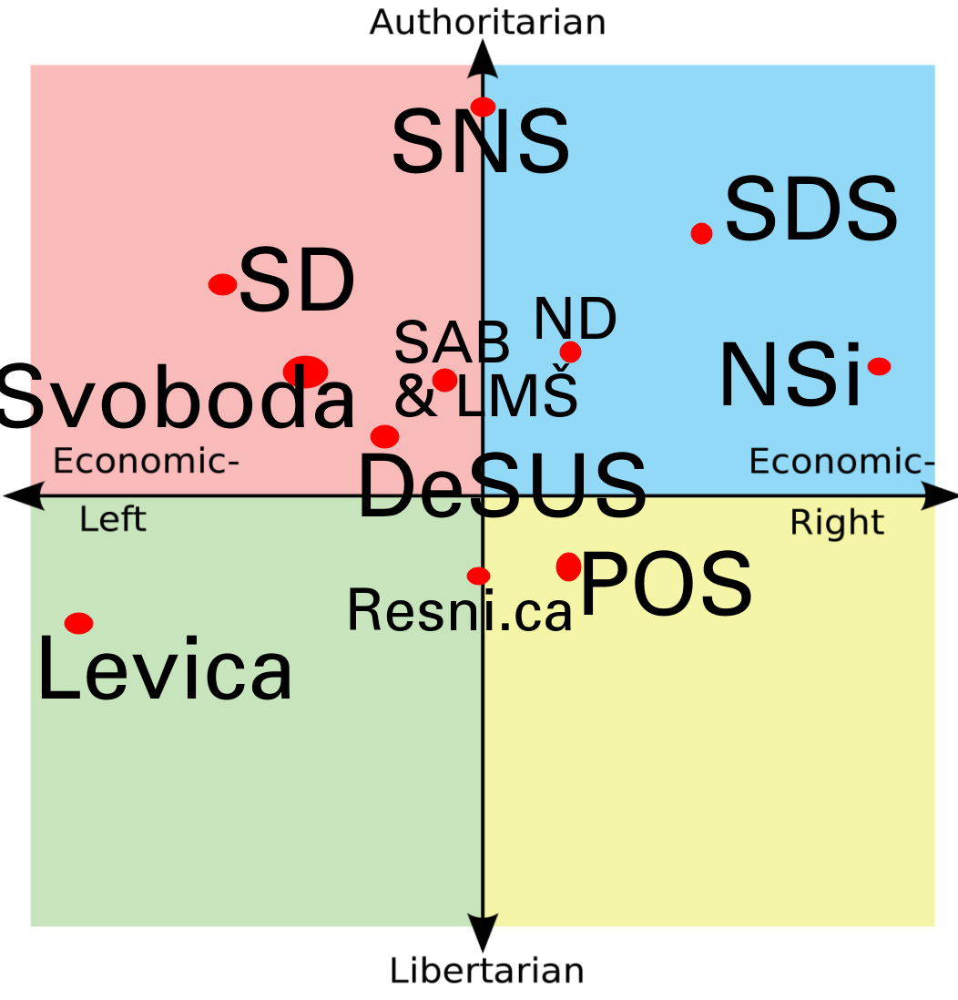
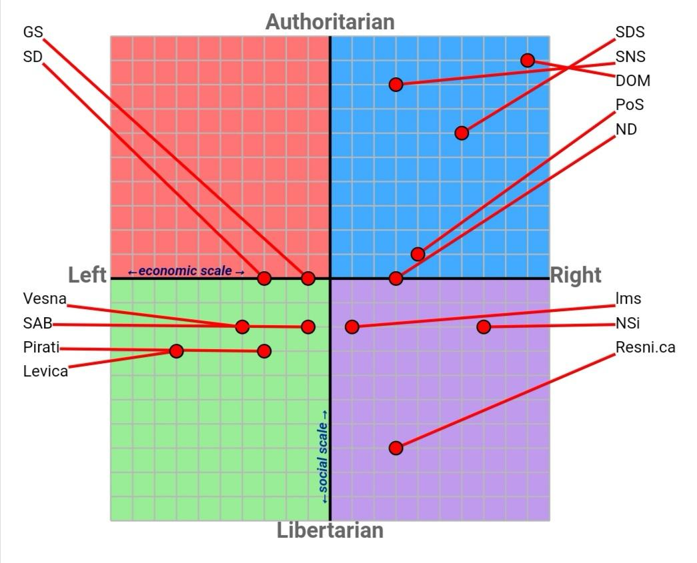

# Analysis of Unbalanced Slovenian Media News Outlets - Left vs. Right Wing

This repository contains a sentiment analysis of political news articles to determine whether a media outlet leans left or right based on its portrayal of political parties.

The repository includes two approaches:

1. **Scraping-Sentiment Approach**:
   - Uses Selenium to scrape news articles from the web.
   - Translates articles to English using the Google Translate API.
   - Performs sentiment analysis using libraries such as `googletrans`, `TextBlob`, `BeautifulSoup`, and `Selenium`.
   - [Scraping-Sentiment](scraping-sentiment/)

   **Note**: This approach was discontinued due to the labor-intensive nature of the manual scraping process. Only 24ur.si was scraped.

2. **Pure LLM Approach**:
   - Uses a large language model (ChatGPT 4.0, as of July 4, 2024) to perform sentiment analysis directly using zero-shot learning.
   - [Pure-LLM](pure-LLM/)

The results presented here are based solely on the Pure LLM approach.

## Pure LLM Approach

In the Pure LLM approach, the ChatGPT 4.0 model was used to determine the sentiment of news articles through zero-shot learning. We manually copied 10 to 15 articles (5000 to 7000 words) from each news outlet for each political party and analyzed the sentiment using ChatGPT 4.0. The articles are available in the [pure-LLM/website-text](pure-LLM/website-text) folder.

### Prompt Used
The following prompt was used for ChatGPT 4.0:

> Please analyze the sentiment of the writer towards the Slovenian political party <political party name> and its president <political party president full name> based on the provided news articles. Focus on the writer's tone, choice of words, and overall portrayal of the party and its members. At the end of your analysis, provide a sentiment score ranging from -5 to +5, where -5 indicates a highly negative sentiment, 0 indicates neutrality, and +5 indicates a highly positive sentiment.

The full responses can be found in the [pure-LLM/chatgpt-response.txt](pure-LLM/chatgpt-response.txt) file.

## Results

Slovenia has several major political parties: SDS, NSi, Svoboda, and Levica, each with distinct political alignments. Below are rough estimates of the political spectrum in Slovenia, as depicted in three images sourced from Reddit (accuracy may vary):

  
  
  

### Selected Parties for Analysis
We selected four major political parties with well-defined political views:
- **SDS (Slovenska demokratska stranka)** - Far-right wing
- **NSi (Nova Slovenija)** - Right wing
- **GS (Gibanje Svoboda)** - Left wing
- **Levica** - Far-left wing

### Sentiment Analysis Results
The sentiment scores range from -5 (highly negative) to +5 (highly positive):

| News Outlet | SDS | NSi | Svoboda | Levica |
|-------------|-----|-----|---------|--------|
| 24ur        | -4  | +3  | +4      | +1     |
| nova24      | +4  | +1  | -4      | -4     |
| rtvslo      | +4  | +1  | -2      | +2     |

Nova24 is widely known to be a right-wing news outlet, so it is no surprise that it writes more positively about SDS and NSi, which confirms the reliability of our approach.

### Interpretation
- **24ur**: Slightly left-leaning.
- **nova24**: Right-leaning.
- **RTV Slovenija**: Expected to be neutral as a public broadcaster but shows a right-leaning tendency.

### Be careful which way you lean!

  

*Which way does a tree fall? It falls the way it leans.*

### Future Analysis Targets
We aim to analyze additional media outlets in the future:
- [Demokracija](https://demokracija.si/)
- [Delo](https://www.delo.si/)
- [Necenzurirano](https://necenzurirano.si/)
- [Slovenske Novice](https://www.slovenskenovice.si/)
- [Mladina](https://www.mladina.si/politika/)
- [Zurnal24](https://www.zurnal24.si/)
- [Novice Svet24](https://novice.svet24.si/)
- [Vecer](https://www.vecer.com/)

This ongoing analysis aims to provide a comprehensive view of media bias in Slovenian news outlets.