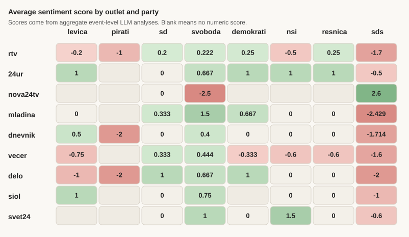
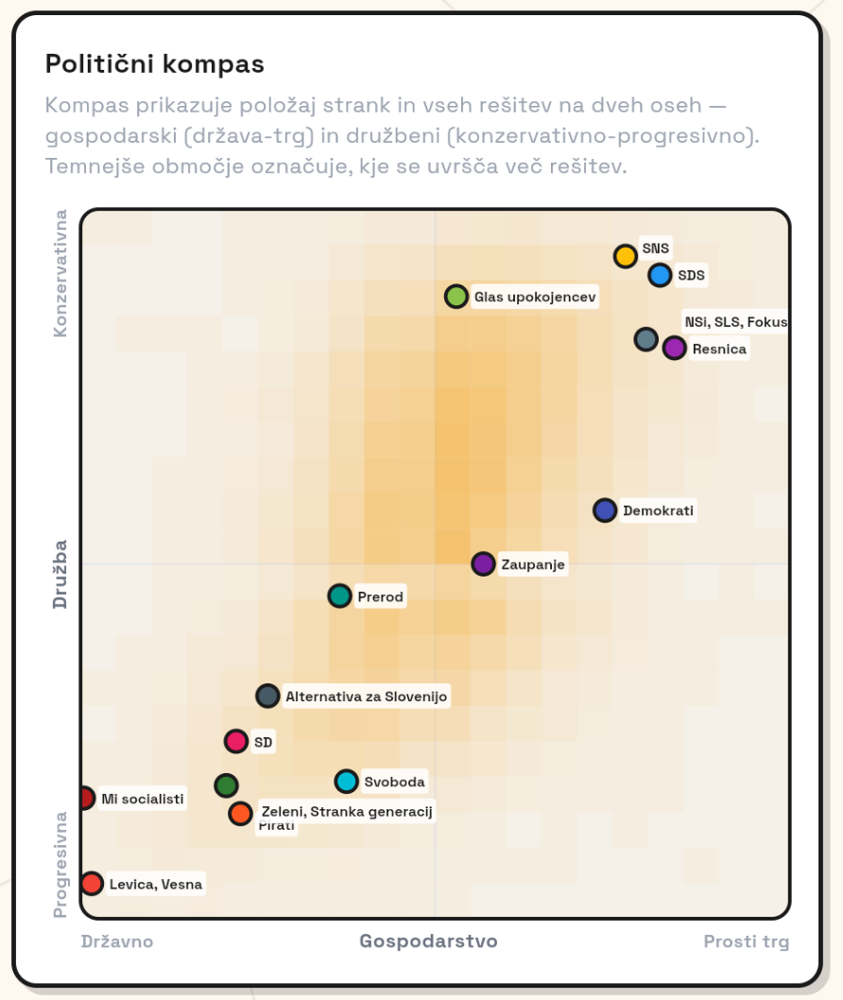

# Mapping Political Bias In Slovenian Media

Most political bias does not arrive wearing a name tag.

It slips in through tone. Through a headline that smirks. Through a paragraph that treats one politician like a statesman and another like a nuisance. Through the tiny choices that make one party sound responsible, another ridiculous, and a third vaguely dangerous without ever saying so outright.

This project is about those choices.

Not who won the election. Not who said what on television. Not which party calls itself left, right, liberal, conservative, patriotic, progressive, or sane. The interesting part is how the story gets told after the facts land on the newsroom desk.

So this repository watches Slovenian media and asks a simple question:

when several outlets look at the same political reality, which way does the story lean?

  

The picture above is the current snapshot from the main pipeline in [`eventregistry-LLM`](eventregistry-LLM/). Green does not mean truth. Red does not mean lies. It just marks whether an outlet's framing of a party tends to come out warmer or colder across many shared events.

Some of it is obvious. `nova24tv` does not exactly hide its feelings about `sds` or `svoboda`. Some of it is messier. Outlets that like to wear the costume of neutrality still drift, and drift is often more interesting than open cheerleading.

## A Map, Not A Verdict

This is not a machine for declaring who is objectively biased and who is pure of heart. It is closer to a magnifying glass.

The model is not supposed to score whether an event was good or bad for a party. It is supposed to look for the outlet's own fingerprints:

- the wording
- the framing
- the choice of emphasis
- the reporting voice
- whether the story sounds neutral, admiring, suspicious, irritated, dismissive, or quietly sympathetic

That is why the aggregate heatmap is only the front window. The real substance sits behind it in the saved event files, summaries, and evidence spans.

If you want to see that layer directly:

- browse the event-backed examples in [`examples.md`](eventregistry-LLM/output/aggregates/examples.md)
- inspect the full aggregate data in [`party_outlet_aggregates.json`](eventregistry-LLM/output/aggregates/party_outlet_aggregates.json)
- open the main pipeline in [`eventregistry-LLM`](eventregistry-LLM/)

## The Cast

The current version tracks coverage from:

`rtv`, `24ur`, `nova24tv`, `mladina`, `dnevnik`, `vecer`, `delo`, `siol`, `svet24`

And it mostly focuses on the Slovenian parties that keep reappearing in the same battles, coalitions, scandals, negotiations, and post-election rituals.

   
  Source: <a href="https://volilnikompas.si">volilnikompas.si</a>

The compass above is not holy scripture. It is just a rough field guide for readers who do not spend their spare time staring at Slovenian coalition math.

## Three Approaches

This repo contains three versions of the same obsession.

[`eventregistry-LLM`](eventregistry-LLM/) is the main one: the current event-based system, where multiple outlets are compared inside the same political event.

[`pure-LLM`](pure-LLM/) is the more reckless earlier phase: batches of articles, manually collected, dropped into ChatGPT to see whether the bias was obvious enough for a model to smell it.

[`scraping-sentiment`](scraping-sentiment/) is the older workshop full of Selenium, brittle scraping, and persistence bordering on self-harm.

Each folder has its own README. Each one shows a different stage of the same idea trying to become something real.

## Read With Suspicion, Including This

The project has limits, and pretending otherwise would make it less interesting, not more.

The scores are relative within events and then averaged. Outlet coverage is uneven. Some events contain repeated articles from the same source. Small numbers near zero often mean ambiguity rather than perfect balance. And any system like this can confuse hostile facts with hostile framing if the prompt is not careful enough.

But that is not a reason to shrug and declare the whole question impossible. It is a reason to look closer.

Because media bias is rarely a cartoon. Usually it is atmosphere. Repetition. Angle. Selection. A hundred small editorial nudges that, taken together, teach the reader who deserves trust, who deserves contempt, and who deserves just enough doubt to never quite stand upright.

That is what this repository is trying to catch.

  

